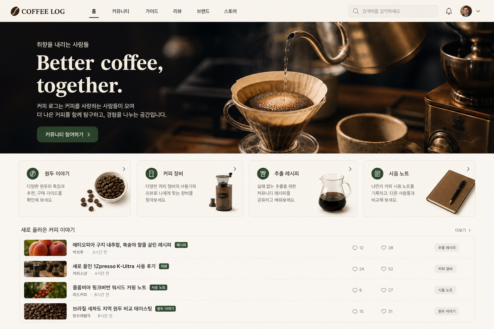
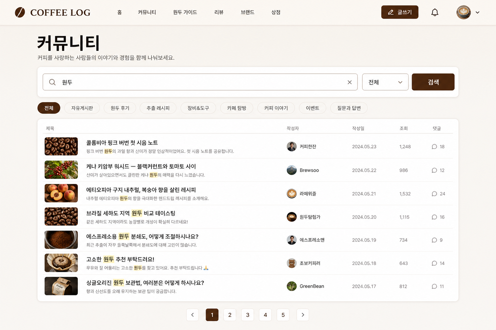
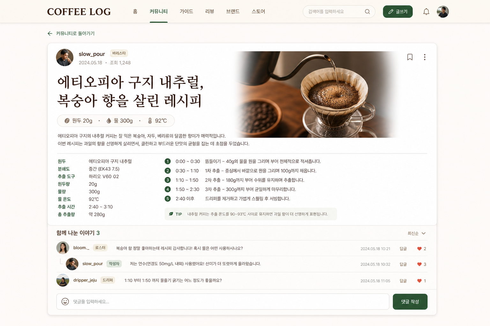
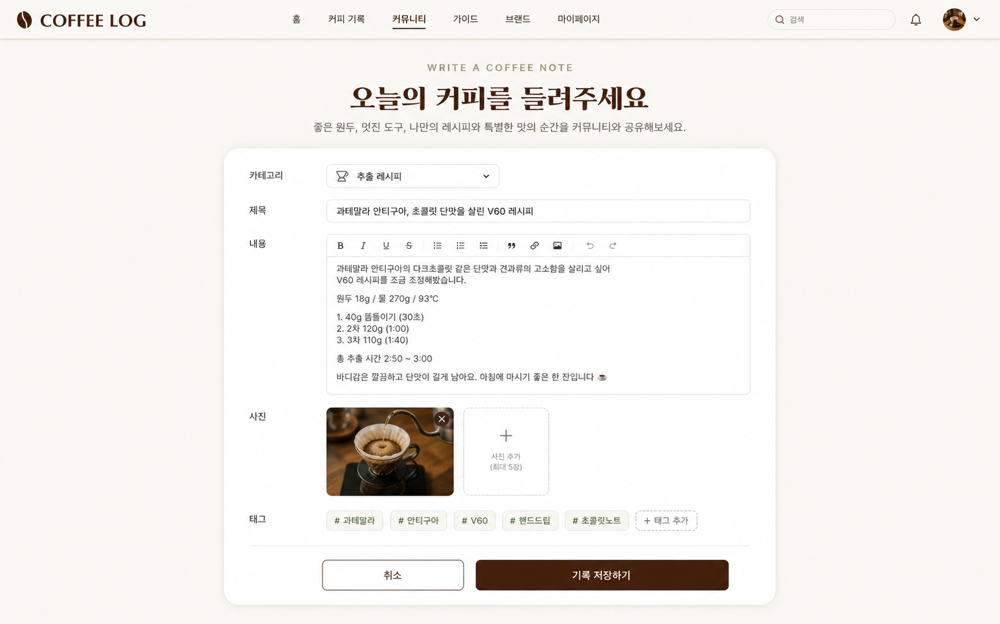
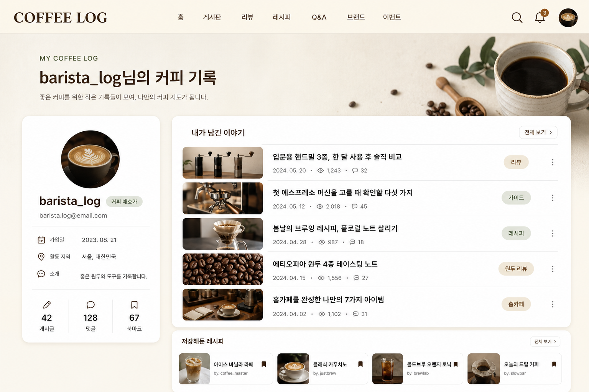
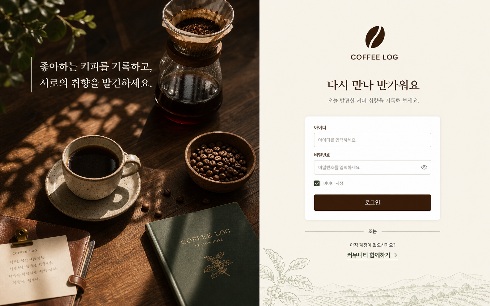

# Coffee Log ☕

> 원두, 장비, 추출 레시피와 시음 경험을 기록하고 함께 나누는 커피 취미 커뮤니티

Coffee Log는 같은 커피 취미를 가진 사람들이 더 맛있는 한 잔을 발견하도록 돕는 Django 기반 커뮤니티입니다. 사용자는 새로운 원두와 장비 사용기, 자신만의 추출 레시피, 카페 및 홈카페 시음 후기를 기록하고 댓글로 의견을 주고받을 수 있습니다.


## 프로젝트 목적

- 흩어져 있는 커피 경험을 하나의 개인 기록으로 축적합니다.
- 원두·장비·레시피·시음 노트를 관심사별로 탐색할 수 있게 합니다.
- 단순 게시판을 넘어 취향이 비슷한 사용자 사이의 대화를 만듭니다.
- Django의 인증, ORM, 클래스 기반 뷰와 서버 사이드 렌더링을 실제 서비스 흐름에 적용합니다.

## 주요 기능

### 커뮤니티

- 게시글 작성·조회·수정·삭제
- 원두·장비·레시피·시음·카페 탐방 카테고리
- 게시글당 이미지 최대 5장 업로드 및 기존 이미지 삭제
- 쉼표 기반 태그 등록과 태그 검색
- 원두량·물양·온도·시간·도구를 표시하는 구조화된 레시피 카드
- 제목·내용·작성자 통합 검색
- 10개 단위 페이지네이션
- `F()` 표현식을 이용한 안전한 조회수 증가
- 원두 이야기, 커피 장비, 추출 레시피, 시음 노트 탐색 진입점

### 댓글과 사용자

- 회원가입, 로그인, 로그아웃
- 작성자 본인만 게시글과 댓글 수정·삭제 가능
- Fetch API 기반 댓글 인라인 수정
- 마이페이지에서 가입 정보와 내가 작성한 글 확인
- 프로필 이미지, 소개, 활동 지역 편집
- 게시글 좋아요와 북마크
- 마이페이지에서 저장한 커피 기록 확인

### 디자인과 공유

- Tailwind CSS 기반 반응형 UI
- 커피 브라운·오트 크림 중심의 브랜드 컬러
- 데스크톱과 모바일 레이아웃 대응
- 카카오톡 공유용 Open Graph 메타 태그
- 1200×630 PNG 대표 이미지 제공
- 포트폴리오 목업과 동일한 분위기의 게시글 사진 및 데모 작성자 프로필 자산

## 기술 스택

| 영역 | 기술 |
|---|---|
| Backend | Python 3.13, Django 6.0 |
| Database | SQLite, Django ORM |
| Frontend | Django Templates, Tailwind CSS CDN, Vanilla JavaScript |
| Authentication | Django Auth, Session |
| Forms | Django Forms, django-widget-tweaks |
| Social Preview | Open Graph, Twitter Card |

## 화면 구성

| URL | 화면 |
|---|---|
| `/` | 커피 커뮤니티 홈, 게시글 목록 및 검색 |
| `/create/` | 새로운 커피 기록 작성 |
| `/<id>/` | 게시글 상세, 조회수, 댓글 |
| `/<id>/update/` | 게시글 수정 |
| `/<id>/delete/` | 게시글 삭제 확인 |
| `/accounts/signup/` | 회원가입 |
| `/accounts/login/` | 로그인 |
| `/accounts/mypage/` | 사용자 정보와 작성 글 |
| `/admin/` | Django 관리자 |

## 데이터 구조

```text
User (Django Auth)
 ├── Post (author)
 └── Comment (author)

Post
 └── Comment (post)
```

- `Post`: 제목, 내용, 작성자, 조회수, 작성·수정 시각
- `Comment`: 내용, 작성자, 연결된 게시글, 작성·수정 시각

## 프로젝트 구조

```text
accounts/                  회원가입, 인증, 마이페이지
board/                     게시글·댓글 모델, 뷰, 폼, URL
board/static/img/          히어로 및 공유 대표 이미지
config/                    Django 프로젝트 설정
templates/                 공통 레이아웃과 로그인 템플릿
portfolio/screenshots/     포트폴리오용 화면 캡처
manage.py
requirements.txt
```

## 로컬 실행

```powershell
python -m venv .venv
.\.venv\Scripts\Activate.ps1
pip install -r requirements.txt
python manage.py migrate
python manage.py runserver
```

브라우저에서 `http://127.0.0.1:8000/`에 접속합니다.

## 구현 포인트

- `LoginRequiredMixin`과 `UserPassesTestMixin`을 조합해 인증과 작성자 권한을 뷰 계층에서 처리했습니다.
- 조회수는 `F('view_count') + 1` 업데이트로 동시 요청 시 값 손실을 방지했습니다.
- 검색 조건은 Django ORM `Q` 객체를 이용해 제목·내용·작성자를 동적으로 결합했습니다.
- 댓글 수정에만 Fetch API를 사용해 전체 SPA로 만들지 않고 필요한 부분의 사용자 경험만 개선했습니다.
- 공유 이미지는 공개 배포 URL 기준의 절대 경로로 생성되며, 카카오 공유 디버거에서 캐시를 갱신할 수 있습니다.

## 포트폴리오 스크린샷

스크린샷은 `portfolio/screenshots/`에 다음 구성으로 저장합니다.

1. `01-home.png` — 브랜드 히어로와 커뮤니티 게시글 목록
2. `02-search.png` — 원두 키워드 검색 결과
3. `03-post-detail.png` — 레시피 게시글과 커뮤니티 댓글
4. `04-write.png` — 커피 기록 작성 화면
5. `05-mypage.png` — 사용자 프로필과 작성 기록
6. `06-login.png` — 로그인 화면

### 커뮤니티 홈



### 원두 검색 결과



### 레시피 게시글과 댓글



### 커피 기록 작성



### 마이페이지



### 로그인



## 현재 범위와 다음 단계

현재 버전은 커피 커뮤니티의 핵심 흐름을 검증하는 MVP입니다. 향후 실제 카테고리 모델, 게시글 이미지 업로드, 좋아요·북마크, 사용자 프로필 이미지, 태그, 알림, PostgreSQL 전환과 운영 서버 배포를 확장할 수 있습니다.
